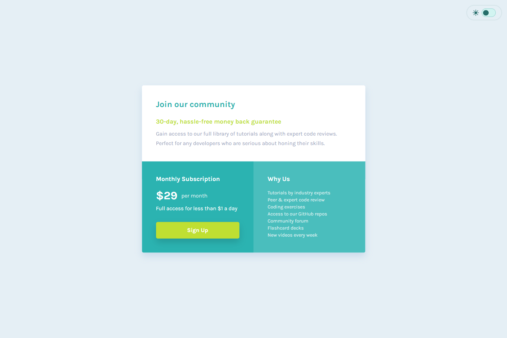

# 💻 Single Price Grid Component

## ℹ️ A Responsive Single Price Grid Component for a Web Development Course

| _Mobile Preview (375x812)_                                   | _Desktop Preview (1440x960)_                                    |
| ------------------------------------------------------------ | --------------------------------------------------------------- |
|       |       |
|  |  |

This project is a responsive pricing component built using semantic HTML and modular CSS. It features a mobile-first layout, dark/light theme toggle, and animated UI transitions.

Created as part of the building challenges from [Frontend Mentor](https://www.frontendmentor.io/).

---

## 🔍 Overview

The component includes a prominent title, value proposition, and a breakdown of pricing and benefits. The layout adapts across screen sizes with fluid media queries and uses CSS grid for structure.

To enhance accessibility and usability, it includes a skip link, WCAG-compliant contrast for both themes, and keyboard-friendly theme toggling. The design was closely aligned with the provided mockup using [PerfectPixel](https://chrome.google.com/webstore/detail/perfectpixel-by-welldonecod/dkaagdgjmgdmbnecmcefdhjekcoceebi).

---

## ✨ Features

- Light/Dark Mode toggle with localStorage theme persistence
- Mobile-first responsive design with media queries
- Semantic HTML and accessible structure (skip link, ARIA labels)
- CSS Grid layout with content stacking and area definitions
- Custom color schemes using CSS variables
- Hover and focus-visible states for interactivity
- Google Lighthouse audited with high scores
- Lightweight build (no frameworks or libraries used)

---

## 🧠 What I Learned

- How to build a pricing grid using **CSS Grid** and semantic structuring
- Leveraged `clamp()` for responsive font sizing
- Used **PerfectPixel** to align elements with design spec
- Applied **box-shadow**, `transition`, and `hover` effects for better UI polish
- Improved layout debugging workflow using mobile-first development
- Ensured **accessibility** with `:focus-visible` and `aria-label` usage

---

## 🛠️ Tech Used

- HTML5
- CSS3
- JavaScript (minimal)
- Git
- GitHub
- Netlify

---

## 🎨 Design Reference & Tools

- JPG design image
- PerfectPixel

---

## 🚀 How to Run

1. Clone the repository
2. Open `index.html` in your browser

---

## 🌐 Live Demo

Or you can check out the 👉 [live website here](https://single-price-grid-component-fm-jiro.netlify.app/)

---

## 📊 Performance Report

A **Google Lighthouse** audit was conducted on the final version of this project. You can view the full report [here](./assets/downloads/lighthouse-performance-report.pdf).

---

## 🧑‍💻 Author

Created by **Elmar Chavez**

🗓️ Month/Year: **July 2025**

📚 Journey: **4th** month of learning _frontend web development_.
